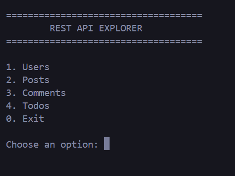
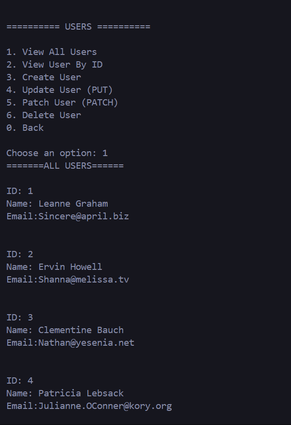
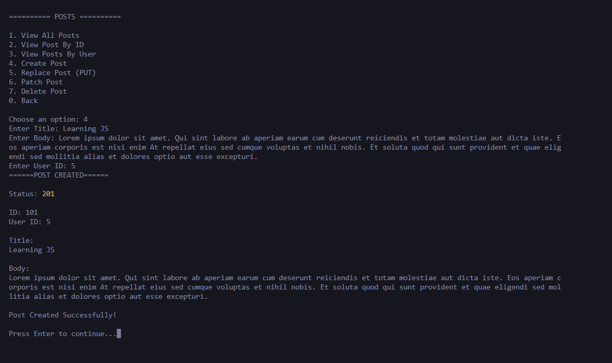
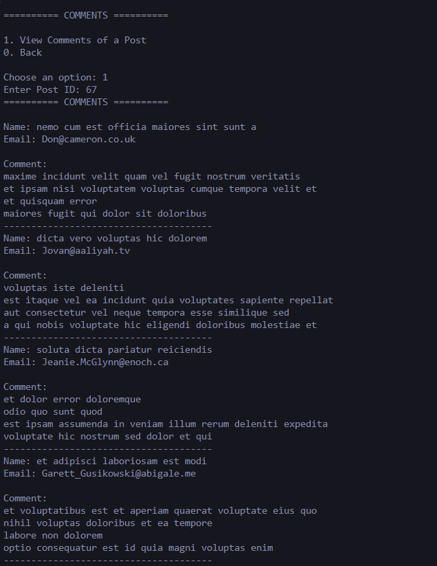
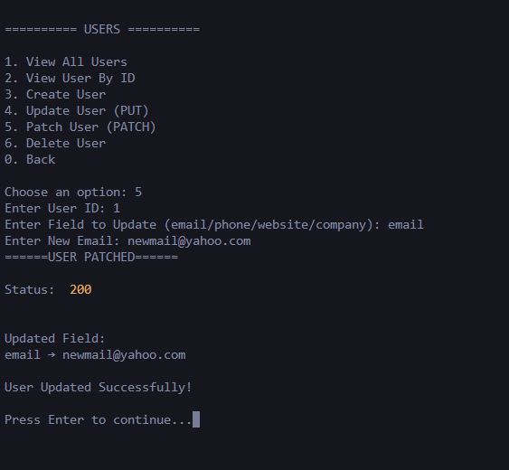

# REST API Explorer (CLI)

A menu-driven Command Line Interface (CLI) application built with **Node.js** to practice working with REST APIs using the Fetch API and Async/Await.

The project uses the free **JSONPlaceholder API** to perform CRUD operations on Users, Posts, Comments, and Todos.

## Features

### Users
- View All Users
- View User By ID
- Create User
- Replace User (PUT)
- Update User (PATCH)
- Delete User

### Posts
- View All Posts
- View Post By ID
- View Posts By User
- Create Post
- Replace Post (PUT)
- Update Post (PATCH)
- Delete Post

### Comments
- View Comments of a Post

### Todos
- View All Todos
- Create Todo
- Delete Todo

## Concepts Practiced

- Fetch API
- Async/Await
- Promises
- HTTP Methods (GET, POST, PUT, PATCH, DELETE)
- REST APIs
- JSON Handling
- Status Codes
- Request & Response
- Error Handling
- Menu-Driven CLI Applications
- Modular JavaScript

## Tech Stack

- JavaScript (Node.js)
- Fetch API
- readline-sync
- JSONPlaceholder API

## Project Structure

```
rest-api-explorer/
│
├── app.js          # CLI menus and user interaction
├── api.js          # API request functions
├── package.json
└── README.md
```

## Installation

```bash
git clone <repository-url>
cd rest-api-explorer
npm install
```

## Run

```bash
node app.js
```

## Sample Menu

```text
====================================
        REST API EXPLORER
====================================

1. Users
2. Posts
3. Comments
4. Todos
0. Exit
```

## API Used

https://jsonplaceholder.typicode.com/

## Learning Outcome

This project was built to strengthen my understanding of:
- Fetch API
- Async/Await
- REST API consumption
- CRUD operations
- Modular JavaScript
- CLI application development
## Screenshots

### Main Menu



---

### View All Users



---

### Create Post



---

### View Comments



---

### Patch User

