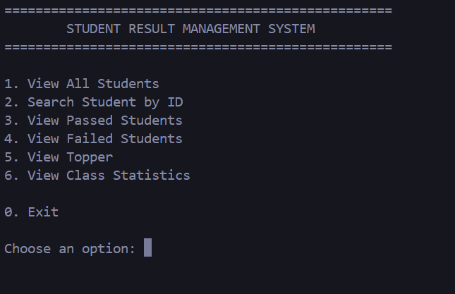

# 🎓 Student Result Management System

A simple **Node.js CLI application** to manage and analyze student results using **CommonJS modules**.

---

## 📌 Features

- ✅ View Student by ID
- ✅ View All Students
- ✅ View Passed Students
- ✅ View Failed Students
- ✅ View Toppers
- ✅ Display Class Statistics
- ✅ Modular Code Structure
- ✅ Helper Module for Average Rounding

---

## 🛠️ Technologies Used

- Node.js
- JavaScript (ES6)
- CommonJS Modules
- readline-sync

---

## 📂 Project Structure

```
student-result-system/
│
├── app.js
├── students.js
├── resultService.js
├── display.js
├── statistics.js
├── helper.js
├── package.json
└── README.md
```

---

## 🚀 Installation

Clone the repository

```bash
gh repo clone Hanzala-Naseer/Backend-Learning-Journey
```

Go to the project directory

```bash
cd student-result-system
```

Install dependencies

```bash
npm install
```

Run the project

```bash
node app.js
```

---

# 📷 Screenshots

## Main Menu




---

## View Student by ID


---

## Passed Students


---

## Failed Students


---

## Toppers


---

## Class Statistics


---

## 📊 Example Output

```text
========== CLASS STATISTICS ==========

Total Students : 8
Highest Marks  : 97
Lowest Marks   : 43
Average Marks  : 74.50

======================================
```

---

## 📖 Learning Objectives

This project helped practice:

- CommonJS Modules
- Exporting & Importing Modules
- Functions
- Arrays
- Objects
- Loops
- Array Methods
- Helper Modules
- Code Reusability
- CLI Applications

---

## 👨‍💻 Author

**Hanzala Naseer**